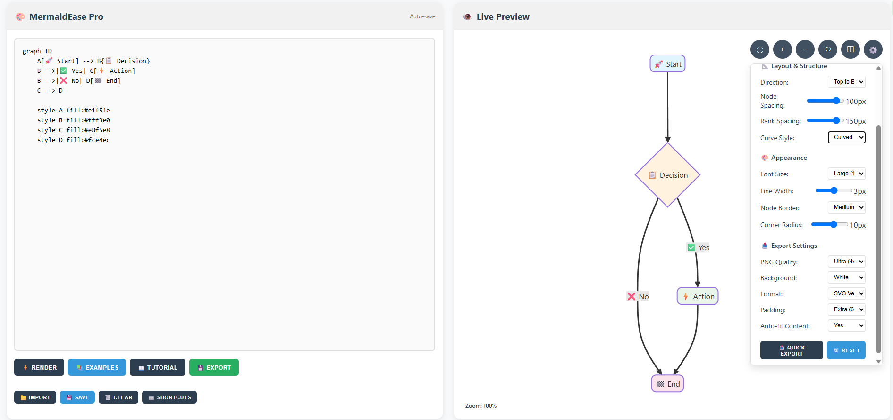

### Generate, customize, and download high-quality Mermaid diagrams with the most powerful free export tool available.

## 🚀 Live Deployment
Experience the tool directly in your browser:  
https://fortunadoralph.github.io/MermaidEase/

## Why MermaidEase?

MermaidEase stands out from other Mermaid tools by offering superior export capabilities completely free of charge. While other tools often limit export resolution or require paid subscriptions for high-quality exports, MermaidEase provides professional-grade SVG and high-resolution PNG exports with no limitations.

## Features

- **Live Preview**: Create diagrams and see them rendered in real-time
- **Multiple Diagram Types**: 
  - Flowcharts
  - Sequence diagrams
  - Class diagrams
  - Entity-Relationship diagrams
  - Gantt charts
  - State diagrams

- **Customization Options**:
  - Multiple pre-defined color themes
  - Custom color picker for nodes, borders, lines, and text
  - Diagram settings panel for fine-tuned control

- **Interactive Controls**:
  - Zoom in/out capability
  - Pan/drag navigation
  - Fullscreen mode
  - Reset view option

- **Advanced Export Capabilities**:
  - SVG export (vector format for perfect scaling)
  - PNG export with adjustable scale factor
  - High-resolution options for printing
  - Custom quality settings

- **User-Friendly Interface**:
  - Example diagrams with one-click loading
  - Intuitive code editor
  - Helpful error messages for debugging
  - Status indicators for actions

- **Professional Output**:
  - Shadow effects on nodes
  - Rounded corners
  - Proper spacing and padding
  - Fully visible edge labels
  - Clean, modern styling

## Browser Compatibility

Works in all modern browsers including:
- Chrome
- Firefox
- Safari
- Edge

## Getting Started

1. Clone this repository
2. Open `index.html` in your browser
3. Start creating your diagrams!

No build process or installation required.

## Usage

1. Write your Mermaid syntax in the editor panel
2. Click \"Generate Preview\" to see your diagram
3. Use the control buttons to adjust the view as needed
4. Export your diagram using \"Quick Export SVG\" or explore more options

## Libraries Used

- [Mermaid.js](https://mermaid.js.org/) - For diagram rendering
- [FileSaver.js](https://github.com/eligrey/FileSaver.js/) - For downloading files
- [Canvg](https://github.com/canvg/canvg) - For SVG to canvas conversion

## License

MIT License - Feel free to use, modify and distribute as needed.

## Contributing

Contributions are welcome! Feel free to open issues or submit pull requests to improve the tool.

---

This tool was created to make the process of generating professional Mermaid diagrams easier and more accessible, with a special focus on providing high-quality exports without cost barriers.`
}
