# 🎨 MermaidEase Pro
### Enhanced Mermaid Diagram Editor with Advanced Features

MermaidEase Pro is a powerful, feature-rich web-based editor for creating stunning Mermaid diagrams with an intuitive interface, real-time preview, and advanced customization options. Built for developers, designers, and anyone who needs to create professional diagrams quickly and efficiently.

## 🚀 Live Deployment
Experience the tool directly in your browser:
**https://fortunadoralph.github.io/MermaidEase/**

## 📋 Table of Contents

- [✨ Features](#-features)
- [🚀 Quick Start](#-quick-start)
- [📊 Supported Diagram Types](#-supported-diagram-types)
- [🎛️ Advanced Settings](#️-advanced-settings)
- [💾 Export Options](#-export-options)
- [🔧 Recent Improvements](#-recent-improvements)
- [📖 Usage Examples](#-usage-examples)
- [⌨️ Keyboard Shortcuts](#️-keyboard-shortcuts)
- [🛠️ Troubleshooting](#️-troubleshooting)
- [🤝 Contributing](#-contributing)
- [📄 License](#-license)
- [🙏 Acknowledgments](#-acknowledgments)

## ✨ Features

### 🎯 Core Features
- **Real-time Preview** - See your diagrams update instantly as you type
- **Auto-save** - Never lose your work with automatic saving to localStorage
- **Responsive Design** - Works perfectly on desktop, tablet, and mobile devices
- **Dark Mode Support** - Automatic dark mode detection for comfortable editing

### 🎨 Customization & Styling
- **Theme Selection** - Choose from multiple built-in themes (Default, Blue, Red, Green)
- **Font Size Control** - Adjust text size from 12px to 18px with immediate preview
- **Node Border Customization** - Control border thickness (1px to 3px) for all diagram elements
- **Line Width Settings** - Customize connection line thickness for better visibility
- **Corner Radius Control** - Adjust node corner roundness for modern aesthetics
- **Direction Control** - Change diagram flow direction (Top-Down, Left-Right, Bottom-Top, Right-Left)

### 📤 Export & Sharing
- **Multiple Export Formats** - Export as SVG (vector) or PNG (raster) with high quality
- **Auto-Fix Export Issues** - Intelligent export correction ensures exports always succeed
- **Quality Settings** - Choose from Standard (1x) to Ultra (4x) resolution for PNG exports
- **Background Options** - Export with white background or transparent background
- **Shareable URLs** - Generate shareable links with embedded diagram code
- **Copy to Clipboard** - Quick copy of SVG code or diagram code

### 🔧 Advanced Tools
- **Zoom Controls** - Zoom in/out with mouse wheel or controls (10% to 500%)
- **Grid Overlay** - Toggle alignment grid for precise positioning
- **Fullscreen Mode** - Distraction-free editing and viewing experience
- **File Import/Export** - Import .mmd, .txt, or .md files and export your work
- **Example Library** - Quick access to common diagram patterns and templates
- **Interactive Tutorial** - Built-in tutorial with syntax reference and examples

## 🚀 Quick Start

1. **Open MermaidEase Pro** in your web browser
2. **Start typing** your Mermaid diagram code in the left panel
3. **Watch the preview** update in real-time on the right panel
4. **Customize appearance** using the settings panel (⚙️ button)
5. **Export your diagram** when ready using the Export dropdown

### Simple Example

## 📊 Supported Diagram Types

MermaidEase Pro supports all major Mermaid diagram types with full customization:

### 🔄 Flowcharts
Perfect for process flows, decision trees, and workflow diagrams.

```mermaid
graph LR
    A[🚀 Start] --> B{📋 Decision}
    B -->|✅ Yes| C[⚡ Action]
    B -->|❌ No| D[🏁 End]
    C --> D
```

### 📞 Sequence Diagrams
Ideal for API interactions, user flows, and system communications.

### 🏗️ Class Diagrams
Essential for software architecture and object-oriented design.

### 📅 Gantt Charts
Perfect for project planning and timeline visualization.

### 🔄 State Diagrams
Great for state machines and process states.

### 🗄️ Entity Relationship Diagrams
Essential for database design and data modeling.

## 🎛️ Advanced Settings

Access the settings panel by clicking the ⚙️ button in the preview area.

### 🎨 Appearance Settings
- **Font Size**: Small (12px), Medium (14px), Large (16px), Extra Large (18px)
- **Line Width**: 1px to 5px for connection lines
- **Node Border**: Thin (1px), Medium (2px), Thick (3px)
- **Corner Radius**: 0px to 15px for rounded corners

### 📐 Layout Settings
- **Direction**: Top-Down (TD), Left-Right (LR), Bottom-Top (BT), Right-Left (RL)
- **Node Spacing**: 30px to 100px between nodes
- **Rank Spacing**: 50px to 150px between levels
- **Curve Style**: Curved, Straight, Stepped, Cardinal

### 📤 Export Settings
- **PNG Quality**: Standard (1x) to Ultra (4x) resolution
- **Background**: White or Transparent
- **Padding**: Minimal (10px) to Extra (60px)
- **Auto-fit Content**: Automatically adjust dimensions to content

## 💾 Export Options

### 📄 SVG Export
- **Vector format** - Scalable without quality loss
- **Small file size** - Efficient for web and print
- **Editable** - Can be modified in vector graphics software

### 🖼️ PNG Export
- **High resolution** - Up to 4x quality for crisp images
- **Universal compatibility** - Works everywhere
- **Customizable background** - White or transparent options

### 📋 Copy Options
- **Copy SVG Code** - Direct SVG markup for embedding
- **Copy Diagram Code** - Mermaid source code for sharing
- **Share URL** - Generate shareable links with embedded diagrams

## 🔧 Recent Improvements

### ✅ Export System Overhaul
- **Auto-Fix Technology** - Exports now always succeed with automatic dimension correction
- **Zoom-Independent Export** - Export quality unaffected by current zoom level
- **Enhanced Error Handling** - Intelligent problem detection and resolution

### 🎨 Appearance Controls Enhancement
- **Real-time Font Size Changes** - Immediate visual feedback for all text elements
- **Comprehensive Node Border Control** - Works across all diagram types
- **Advanced CSS Targeting** - Maximum compatibility with Mermaid's rendering system

### 📐 Direction Control Fix
- **Dynamic Code Modification** - Direction changes automatically update diagram code
- **Immediate Layout Updates** - No manual re-rendering required
- **Cross-Diagram Compatibility** - Works with all supported diagram types

### 🔍 Improved Targeting System
- **MutationObserver Integration** - Catches dynamically added elements
- **Multi-Method Application** - Uses both CSS and SVG attributes for maximum compatibility
- **Debug Capabilities** - Enhanced troubleshooting and monitoring

## 📖 Usage Examples

### Creating a Simple Workflow
1. Select "Flowchart" from the Examples dropdown
2. Modify the nodes and connections as needed
3. Adjust appearance settings for your brand colors
4. Export as PNG for presentations or SVG for web use

### Building a System Architecture
1. Use Class Diagrams for component relationships
2. Add Sequence Diagrams for interaction flows
3. Customize font size for better readability
4. Export high-resolution images for documentation

### Project Planning
1. Create Gantt charts for timeline visualization
2. Use State Diagrams for process flows
3. Adjust layout direction for optimal presentation
4. Share URLs with team members for collaboration

## ⌨️ Keyboard Shortcuts

| Action | Shortcut | Description |
|--------|----------|-------------|
| Render Diagram | `Ctrl + Enter` | Update the preview |
| Save Diagram | `Ctrl + S` | Save to localStorage |
| Toggle Fullscreen | `F11` | Enter/exit fullscreen mode |
| Zoom In | `Ctrl + Plus` | Increase zoom level |
| Zoom Out | `Ctrl + Minus` | Decrease zoom level |
| Reset Zoom | `Ctrl + 0` | Reset to 100% zoom |
| Toggle Grid | `Ctrl + G` | Show/hide alignment grid |

## 🛠️ Troubleshooting

### Common Issues and Solutions

#### Export Not Working
- **Issue**: Export button doesn't respond
- **Solution**: The new auto-fix system should resolve this automatically. Check browser console for any errors.

#### Font Size Not Changing
- **Issue**: Text size doesn't update when changing font size setting
- **Solution**: Recent improvements should fix this. Try refreshing the page and re-applying settings.

#### Diagram Not Rendering
- **Issue**: Preview shows error or blank
- **Solution**: Check Mermaid syntax. Use the Tutorial for syntax reference.

#### Performance Issues
- **Issue**: Slow rendering with large diagrams
- **Solution**: Reduce zoom level, simplify diagram structure, or break into smaller diagrams.

### Browser Compatibility
- **Chrome/Edge**: Full support (recommended)
- **Firefox**: Full support
- **Safari**: Full support
- **Mobile browsers**: Responsive design with touch support

### Getting Help
1. Check the built-in Tutorial for syntax help
2. Refer to [Mermaid.js documentation](https://mermaid.js.org/)
3. Use browser developer tools to check for JavaScript errors
4. Try the example diagrams to verify functionality

## 🤝 Contributing

We welcome contributions to MermaidEase Pro! Here's how you can help:

### Development Setup
1. Clone the repository
2. Open `index.html` in a web browser
3. Make your changes
4. Test thoroughly across different browsers
5. Submit a pull request

### Areas for Contribution
- 🐛 Bug fixes and improvements
- ✨ New features and enhancements
- 📚 Documentation improvements
- 🎨 UI/UX enhancements
- 🧪 Testing and quality assurance

## 📄 License

This project is licensed under the MIT License - see the [LICENSE](LICENSE) file for details.

## 🙏 Acknowledgments

### Core Technologies
- **[Mermaid.js](https://mermaid.js.org/)** - The powerful diagramming library that makes this all possible
- **[FileSaver.js](https://github.com/eligrey/FileSaver.js/)** - Client-side file saving functionality
- **Modern Web Standards** - HTML5, CSS3, and ES6+ JavaScript

### Special Thanks
- The Mermaid.js team for creating an amazing diagramming syntax
- The open-source community for continuous inspiration and feedback
- All users who provide valuable feedback and feature requests

### Inspiration
MermaidEase Pro was built to bridge the gap between Mermaid's powerful syntax and user-friendly diagram creation, making professional diagramming accessible to everyone.

### Why MermaidEase Pro?

MermaidEase Pro stands out from other Mermaid tools by offering superior export capabilities completely free of charge. While other tools often limit export resolution or require paid subscriptions for high-quality exports, MermaidEase Pro provides professional-grade SVG and high-resolution PNG exports with no limitations.

---

**Made with ❤️ for the developer community**

*Create beautiful diagrams effortlessly with MermaidEase Pro*
